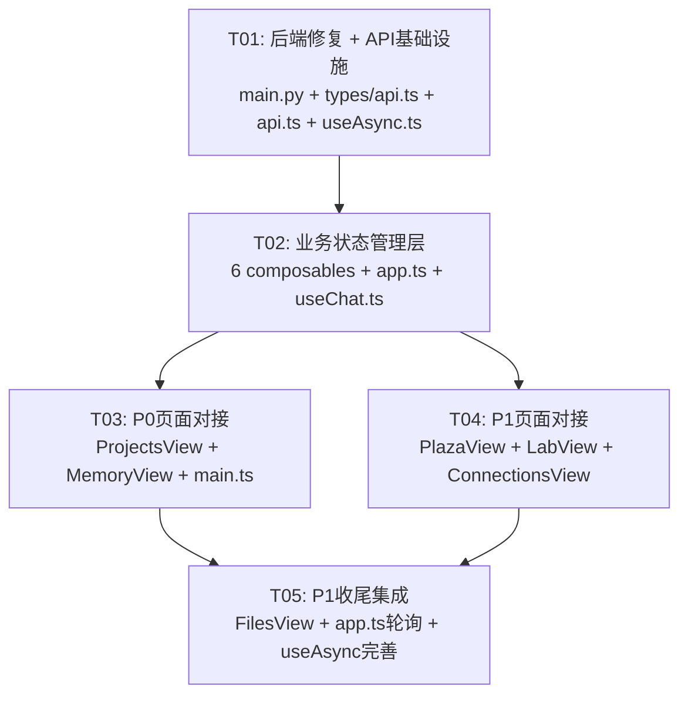

# 超级牛马 v1.5 前后端对接集成 — 系统设计文档

> **Architect**: Bob | **Date**: 2026-07-01 | **Version**: 1.0

---

## Part A: 系统设计

### 1. 实现方案

#### 1.1 核心技术挑战

| 挑战 | 分析 | 决策 |
|------|------|------|
| **6 页面 Mock→真实数据** | 每个页面都有内联类型定义和硬编码 mock 数组 | 逐页面替换，保持 UI 结构不变，仅替换数据源 |
| **API 客户端扩展** | 当前 api.ts 仅覆盖 chat/workspace/models/health 4 个域 | 按后端路由模块补全所有端点，遵循现有零依赖 fetch 风格 |
| **响应格式统一** | 后端 `{ code, data, message, request_id }`，成功 code=0，错误 code 为字符串 | 在 api.ts 层做统一解包，composable 层只感知 `data` |
| **三态模式 (loading/error/data)** | 当前无统一模式，ChatView 只在 useChat 中有部分状态 | 创建 `useAsync` composable 封装三态逻辑 |
| **P0-1 启动 Bug** | `main.py` 导入不存在的 `lifecycle` 模块（实际是 `data_lifecycle`） | 删除 `lifecycle` 导入和路由注册 |
| **P0-2 CORS** | 当前 CORS origins 只有 `localhost:18080`/`127.0.0.1:18080` | 追加 `localhost:5173` |

#### 1.2 数据流设计

```
┌──────────────┐     ┌─────────────────┐     ┌──────────────────┐
│  Vue Views   │────▶│   Composables   │────▶│   api.ts (fetch) │
│  (模板层)     │◀────│   (状态管理层)    │◀────│   (传输层)        │
└──────────────┘     └─────────────────┘     └────────┬─────────┘
                                                      │ HTTP
                                              ┌───────▼─────────┐
                                              │  FastAPI :18080 │
                                              └─────────────────┘
```

- **Views**：纯模板+事件绑定，通过 composable 获取响应式数据
- **Composables**：封装 `ref/reactive` + api 调用 + 三态管理，每个页面一个 composable
- **api.ts**：统一 fetch 封装，类型标注，错误转换

#### 1.3 架构决策

| 决策点 | 选择 | 理由 |
|--------|------|------|
| 状态管理 | Composable (Vue3 组合式) + stores/app.ts | 已有基础设施，无需引入 Pinia 额外依赖 |
| HTTP 客户端 | 原生 fetch（零依赖） | 与现有 api.ts 风格一致，不引入 axios |
| 类型定义 | 新建 `types/api.ts` 集中管理 | 避免各页面重复定义接口类型 |
| 三态模式 | `useAsync` composable | 统一 loading/error/data 处理，可复用 |
| 数据刷新 | 轮询（`setInterval`） | v1.5 无认证无 WebSocket，简单轮询是最小成本方案 |
| 错误边界 | api.ts 层拦截 + composable 层消费 | 分层清晰，无需全局错误组件 |

---

### 2. 框架选型

#### 2.1 现有依赖确认

| 依赖 | 版本 | 用途 |
|------|------|------|
| vue | ^3.4 | 核心框架 |
| vue-router | ^4 | 路由 |
| vite | ^5 | 构建工具 |
| typescript | ^5 | 类型系统 |

#### 2.2 是否需要新增依赖？

**不需要。** 当前需求全部可通过以下方式满足：
- 原生 `fetch` + `AbortController`（HTTP 请求）
- Vue3 `ref/reactive/computed/watch`（响应式状态）
- TypeScript `interface/type`（类型定义）
- `setInterval`（轮询刷新）

**零新增 npm 依赖** — 符合"最小变更"原则。

---

### 3. 文件变更清单

#### 3.1 后端（1 文件修改）

| 文件 | 操作 | 说明 |
|------|------|------|
| `backend/main.py` | 修改 | P0-1: 删除 lifecycle 导入和路由注册；P0-2: CORS origins 追加 localhost:5173 |

#### 3.2 前端（6 新增 + 9 修改）

| 文件 | 操作 | 说明 |
|------|------|------|
| `frontend-vue/src/types/api.ts` | **新增** | 共享 API 类型定义（响应格式、分页、各模块数据类型） |
| `frontend-vue/src/composables/useAsync.ts` | **新增** | 通用三态（loading/error/data）+ 轮询 composable |
| `frontend-vue/src/composables/useProjects.ts` | **新增** | 工作间 CRUD + Kanban 状态管理 |
| `frontend-vue/src/composables/useMemory.ts` | **新增** | 记忆 L1/L2/L3 三 Tab 状态管理 |
| `frontend-vue/src/composables/usePlaza.ts` | **新增** | 广场 Skills/Experts/Models 三 Tab 状态管理 |
| `frontend-vue/src/composables/useLab.ts` | **新增** | 实验室 Dashboard/Mesh/Emergence 三 Tab 状态管理 |
| `frontend-vue/src/services/api.ts` | 修改 | P0-3: 补全所有 P0+P1 API 端点 + 统一错误处理 + 响应解包 |
| `frontend-vue/src/views/ProjectsView.vue` | 修改 | P0-4: mock → useProjects composable |
| `frontend-vue/src/views/MemoryView.vue` | 修改 | P0-5: mock → useMemory composable |
| `frontend-vue/src/views/PlazaView.vue` | 修改 | P1-1: mock → usePlaza composable |
| `frontend-vue/src/views/LabView.vue` | 修改 | P1-2: mock → useLab composable |
| `frontend-vue/src/views/ConnectionsView.vue` | 修改 | P1-3: mock → API 连接状态 |
| `frontend-vue/src/views/FilesView.vue` | 修改 | P1-4: mock → 备份/导出 API |
| `frontend-vue/src/stores/app.ts` | 修改 | P1-5: 工作间状态与 useProjects 联动 |
| `frontend-vue/src/composables/useChat.ts` | 修改 | 共享类型引用从 types/api.ts 导入 |

---

### 4. 数据结构和接口

#### 4.1 API 响应类型（types/api.ts）

```typescript
// ═══ 通用响应格式 ═══

/** 后端统一响应包装 */
interface ApiResponse<T = unknown> {
  code: number | string    // 成功为 0，错误为字符串如 "WORKSPACE_NOT_FOUND"
  data: T | null
  message: string
  request_id?: string
}

/** 分页数据 */
interface PaginatedData<T> {
  items: T[]
  pagination: {
    page: number
    page_size: number
    total: number
    total_pages: number
  }
}

// ═══ 工作间 ═══
interface WorkspaceItem {
  id: string
  name: string
  icon?: string
  theme_color?: string
  template?: string
  agent_count?: number
  task_count?: number
  created_at?: string
  updated_at?: string
}

// ═══ Agent ═══
interface AgentItem {
  id: string
  name: string
  role?: string
  status: 'online' | 'offline' | 'busy'
  model?: string
  workspace_id: string
  created_at?: string
}

// ═══ Kanban Task（使用 Agent 的 status/task 信息映射到看板列）═══
// 前端自行维护列映射：根据 Agent 状态分配到 todo/in_progress/review/done

// ═══ 记忆 ═══
interface MemoryContextStats {
  l1_active_sessions?: number
  l2_total_entries?: number
  l3_total_entries?: number
  // ...
}

interface L1SessionInfo {
  workspace_id: string
  session_id: string
  message_count: number
  token_count: number
  created_at: string
  last_active: string
}

interface L2MemoryEntry {
  id: string
  entry_type: 'request' | 'learned' | 'completed' | 'decision' | 'error' | 'custom' | 'compress_event'
  content: string
  summary?: string
  tags: string[]
  observation_type?: string
  created_at: string
  expires_at?: string
}

interface L3KnowledgeEntry {
  id: string
  title: string
  summary: string
  schema_type: string
  source: string
  retrieval_count: number
  created_at: string
}

// ═══ 广场 ═══
interface SkillItem {
  id: string
  name: string
  description?: string
  author?: string
  stars?: number
  category?: string
  enabled?: boolean
}

interface ModelMarketItem {
  id: string
  name: string
  provider: string
  type: 'cloud' | 'local'
  description: string
  scenarios: string[]
  pricing?: string
  evaluation?: { score: number }
}

// ═══ 实验室 ═══
interface DashboardOverview {
  active_agents: number
  total_agents: number
  today_tokens: number
  today_tasks: number
  token_budget?: number
  token_percent?: number
}

interface MeshStatus {
  node_count: number
  healthy_peers: number
  covered_models: number
  is_contributing: boolean
}

interface MeshPeer {
  node_id: string
  hostname: string
  ip_address: string
  status: 'online' | 'offline'
  load: number
  role: 'root' | 'neighbor'
}

interface EmergenceInsight {
  id: string
  title?: string
  description: string
  modules: string[]
  impact: 'high' | 'medium' | 'low'
  status: string
  created_at: string
}

// ═══ 备份/文件 ═══
interface BackupItem {
  id: string
  filename: string
  size_bytes: number
  created_at: string
}

interface ChatExportRecord {
  role: string
  content: string
  model: string
  created_at: string
}
```

#### 4.2 Composable 接口设计

##### useAsync — 通用三态工具

```typescript
function useAsync<T>() {
  // 状态
  loading: Ref<boolean>
  error: Ref<string | null>
  data: Ref<T | null>

  // 方法
  execute(fetcher: () => Promise<T>): Promise<void>
  reset(): void
}

function usePolling<T>(
  fetcher: () => Promise<T>,
  intervalMs: number
): { data: Ref<T | null>; loading: Ref<boolean>; error: Ref<string | null>; start(): void; stop(): void }
```

##### useProjects — 项目页

```typescript
function useProjects() {
  // 工作间
  workspaces: Ref<WorkspaceItem[]>
  activeWorkspace: Ref<WorkspaceItem | null>
  wsLoading: Ref<boolean>
  wsError: Ref<string | null>

  // Kanban（Agents 映射到列）
  agents: Ref<AgentItem[]>
  agentsLoading: Ref<boolean>
  columnTasks: (col: string) => AgentItem[]

  // 操作
  loadWorkspaces(): Promise<void>
  selectWorkspace(ws: WorkspaceItem): void
  createWorkspace(name: string): Promise<void>
  deleteWorkspace(id: string): Promise<void>
}
```

##### useMemory — 记忆页

```typescript
function useMemory() {
  activeTab: Ref<'diary' | 'dreams' | 'longterm'>

  // L1 — 日记
  l1Snapshot: Ref<L1SessionInfo | null>
  l1Loading: Ref<boolean>

  // L2 — 梦境（短期记忆）
  l2Entries: Ref<L2MemoryEntry[]>
  l2Loading: Ref<boolean>
  l2Pagination: Ref<{ page: number; total: number }>

  // L3 — 长期记忆
  l3Overview: Ref<L3KnowledgeEntry[] | null>
  l3Loading: Ref<boolean>

  // 操作
  loadL1(workspaceId: string): Promise<void>
  loadL2(workspaceId: string, entryType?: string): Promise<void>
  loadL3(workspaceId: string): Promise<void>
}
```

##### usePlaza — 广场页

```typescript
function usePlaza() {
  activeTab: Ref<'skills' | 'experts' | 'models'>

  // Skills 市场
  marketSkills: Ref<SkillItem[]>
  skillsLoading: Ref<boolean>

  // Experts（复用 Agent 接口）
  experts: Ref<AgentItem[]>
  expertsLoading: Ref<boolean>

  // Models 市场
  models: Ref<ModelMarketItem[]>
  modelsLoading: Ref<boolean>
  availableModels: Ref<ModelMarketItem[]>

  // 操作
  loadSkills(): Promise<void>
  loadExperts(): Promise<void>
  loadModels(): Promise<void>
}
```

##### useLab — 实验室页

```typescript
function useLab() {
  activeTab: Ref<'dashboard' | 'mesh' | 'emergence'>

  // Dashboard
  overview: Ref<DashboardOverview | null>
  dashboardLoading: Ref<boolean>

  // Mesh
  meshStatus: Ref<MeshStatus | null>
  meshPeers: Ref<MeshPeer[]>
  meshLoading: Ref<boolean>

  // Emergence
  insights: Ref<EmergenceInsight[]>
  emergenceLoading: Ref<boolean>

  // 操作
  loadDashboard(): Promise<void>
  loadMesh(): Promise<void>
  loadEmergence(): Promise<void>
}
```

#### 4.3 API 客户端扩展（api.ts）

在现有 `api` 对象的基础上追加以下端点组：

```
api.workspaces.get(id)          GET    /api/v1/workspaces/{id}
api.workspaces.update(id, data) PUT    /api/v1/workspaces/{id}
api.workspaces.delete(id)       DELETE /api/v1/workspaces/{id}
api.workspaces.templates()      GET    /api/v1/workspaces/templates
api.workspaces.getAgents(wsId)  GET    /api/v1/workspaces/{wsId}/agents
api.workspaces.createAgent(...) POST   /api/v1/workspaces/{wsId}/agents

api.memory.context(wsId)        GET    /api/v1/memory/context?workspace_id=
api.memory.l1(wsId)             GET    /api/v1/memory/l1/{wsId}
api.memory.l2(wsId, params)     GET    /api/v1/memory/l2/{wsId}?entry_type=&page=
api.memory.l3(wsId)             GET    /api/v1/memory/l3/{wsId}

api.skills.market(category?)    GET    /api/v1/skills/market?category=
api.skills.my()                 GET    /api/v1/skills/my

api.dashboard.overview()        GET    /api/v1/dashboard/overview

api.mesh.status()               GET    /api/v1/mesh/status
api.mesh.peers()                GET    /api/v1/mesh/peers

api.emergence.insights(status?) GET    /api/v1/emergence/insights?status=

api.backup.list()               GET    /api/v1/backup
api.backup.create()             POST   /api/v1/backup
api.backup.download(id)         GET    /api/v1/backup/{id}/download (返回 Blob URL)
api.backup.exportChat(wsId)     GET    /api/v1/export/chat-history?workspace_id=
```

---

### 5. 程序调用流程

#### 5.1 项目页加载流程

```
User → ProjectsView.vue
         │
         ▼
  useProjects() composable
         │
         ├─ loadWorkspaces()
         │    └─ api.workspaces.list() ──▶ GET /api/v1/workspaces
         │         └─ 返回 WorkspaceItem[]
         │
         └─ selectWorkspace(ws)
              └─ api.workspaces.getAgents(ws.id) ──▶ GET /api/v1/workspaces/{id}/agents
                   └─ 返回 AgentItem[] ──▶ 映射到 Kanban 四列
```

#### 5.2 记忆页 Tab 切换流程

```
User → MemoryView.vue (activeTab='diary')
         │
         ▼
  useMemory() composable
         │
         ├─ [diary]  loadL1(wsId)   ──▶ GET /api/v1/memory/l1/{wsId}
         ├─ [dreams] loadL2(wsId, 'compress_event')
         │                ──▶ GET /api/v1/memory/l2/{wsId}?entry_type=compress_event
         └─ [longterm] loadL3(wsId) ──▶ GET /api/v1/memory/l3/{wsId}
```

#### 5.3 广场页加载流程

```
User → PlazaView.vue
         │
         ▼
  usePlaza() composable
         │
         ├─ [skills]  loadSkills()  ──▶ GET /api/v1/skills/market
         ├─ [experts] loadExperts() ──▶ GET /api/v1/workspaces/default/agents
         └─ [models]  loadModels()  ──▶ GET /api/v1/models/marketplace (已存在)
```

#### 5.4 API 统一错误处理流程

```
api.ts 中每个 fetch 调用
  │
  ├─ res.ok ──▶ json() ──▶ 检查 code === 0 ──▶ 返回 data
  │                              │
  │                              └─ code !== 0 ──▶ throw ApiError(message, code)
  │
  └─ !res.ok ──▶ throw NetworkError(status, statusText)

Composable 层
  ├─ try { data = await api.xxx() } catch (e) { error = e.message }
  └─ finally { loading = false }
```

---

### 6. 待明确事项

| # | 事项 | 假设 | 影响 |
|---|------|------|------|
| 1 | `lifecycle` 模块：是 `data_lifecycle.py` 的别名还是已删除的功能？ | **假设**：`lifecycle.py` 从未存在，`data_lifecycle.py` 通过自己的 prefix 注册路由，main.py 中的 `lifecycle` 导入是残留代码 | 直接删除 main.py 中 import 和 include_router 两行 |
| 2 | Kanban 看板的后端数据源：是否有独立的 Kanban/task 端点？ | **假设**：使用 Agents 列表映射到看板列（根据 agent.status: online→done, busy→in_progress, offline→todo） | 如后端有独立 task 端点则需调整 |
| 3 | 广场 "Experts" Tab 数据源 | **假设**：使用 `/api/v1/workspaces/{wsId}/agents` 获取 Agent 列表作为 Experts | 如后端有独立 experts 端点则需调整 |
| 4 | 连接页数据源 | **假设**：后端暂无外部连接管理 API，v1.5 连接页保留为静态展示（MCP 已连接，其余未连接） | P1-3 实际工作量很小，以展示为主 |
| 5 | `lifecycle` 路由注册行是否需要一并删除 | **假设**：是。`app.include_router(lifecycle.router, tags=["清风·数据管理"])` 一并删除 | `data_lifecycle.py` 已有自己的 prefix 和 tags，不会丢失功能 |

---

## Part B: 任务分解

### 7. 依赖包列表

```
无需新增依赖。现有依赖已满足全部需求：
- vue@^3.4          — 响应式框架
- vue-router@^4      — 路由（已完成）
- vite@^5            — 构建工具（已完成）
- typescript@^5      — 类型系统（已完成）
```

---

### 8. 任务列表（按实现顺序）

#### T01: 后端修复 + API 客户端基础设施

| 属性 | 内容 |
|------|------|
| **Task ID** | T01 |
| **优先级** | P0 |
| **依赖** | 无 |

**文件变更**：

| 文件 | 操作 | 内容 |
|------|------|------|
| `backend/main.py` | 修改 | ① 删除第56行 `lifecycle,` 导入；② 删除第305行 `app.include_router(lifecycle.router, ...)`；③ CORS origins 追加 `"http://localhost:5173"` |
| `frontend-vue/src/types/api.ts` | **新建** | 定义全部共享类型：`ApiResponse<T>`, `PaginatedData<T>`, `WorkspaceItem`, `AgentItem`, `L1SessionInfo`, `L2MemoryEntry`, `L3KnowledgeEntry`, `SkillItem`, `ModelMarketItem`, `DashboardOverview`, `MeshStatus`, `MeshPeer`, `EmergenceInsight`, `BackupItem`, `ChatExportRecord`。以及 `ApiError` 类 |
| `frontend-vue/src/services/api.ts` | 修改 | ① 引入 `types/api.ts` 类型；② 添加 `unwrapResponse<T>()` 统一解包函数（检查 code，抛 ApiError）；③ 重构现有端点使用 unwrap；④ 追加 P0+P1 全部新端点（含类型标注） |
| `frontend-vue/src/composables/useAsync.ts` | **新建** | 实现 `useAsync<T>()`（loading/error/data 三态 + execute）和 `usePolling<T>()`（轮询 start/stop） |

**出站 API 端点清单**（在 api.ts 中实现）：
```
workspaces.get / workspaces.update / workspaces.delete / workspaces.templates
workspaces.getAgents / workspaces.createAgent
memory.context / memory.l1 / memory.l2 / memory.l3
skills.market / skills.my
dashboard.overview
mesh.status / mesh.peers
emergence.insights
backup.list / backup.create / backup.download / backup.exportChat
models.marketplace (已存在，补全类型)
```

---

#### T02: 业务状态管理层（Composables）

| 属性 | 内容 |
|------|------|
| **Task ID** | T02 |
| **优先级** | P0 |
| **依赖** | T01 |

**文件变更**：

| 文件 | 操作 | 内容 |
|------|------|------|
| `frontend-vue/src/composables/useProjects.ts` | **新建** | 封装工作间 CRUD + Kanban 状态。使用 `useAsync` 管理三态。提供 `loadWorkspaces`, `selectWorkspace`, `createWorkspace`, `deleteWorkspace`, `columnTasks` |
| `frontend-vue/src/composables/useMemory.ts` | **新建** | 封装记忆 L1/L2/L3 三 Tab 状态。`loadL1`, `loadL2(entryType?)`, `loadL3`。memory/context 作为额外统计 |
| `frontend-vue/src/composables/usePlaza.ts` | **新建** | 封装广场 Skills/Experts/Models 三 Tab 状态。`loadMarketSkills`, `loadExperts`(→agents), `loadModels` |
| `frontend-vue/src/composables/useLab.ts` | **新建** | 封装实验室 Dashboard/Mesh/Emergence 三 Tab 状态。`loadDashboard`, `loadMesh`, `loadEmergence` |
| `frontend-vue/src/composables/useFiles.ts` | **新建** | 封装文件页备份列表 + 导出状态。`loadBackups`, `createBackup`, `exportChat` |
| `frontend-vue/src/composables/useConnections.ts` | **新建** | 封装连接页状态（当前以静态展示为主，MCP 状态可通过 health 端点获取） |
| `frontend-vue/src/stores/app.ts` | 修改 | ① 更新 `Workspace` 接口引用 `types/api.ts` 的 `WorkspaceItem`；② 添加 `loadWorkspaces()` action 供全局使用 |
| `frontend-vue/src/composables/useChat.ts` | 修改 | 将本地 `ChatMessage`/`Conversation` 类型改为从 `types/api.ts` 导入 |

---

#### T03: P0 核心页面对接（项目 + 记忆）

| 属性 | 内容 |
|------|------|
| **Task ID** | T03 |
| **优先级** | P0 |
| **依赖** | T02 |

**文件变更**：

| 文件 | 操作 | 内容 |
|------|------|------|
| `frontend-vue/src/views/ProjectsView.vue` | 修改 | ① 删除 `<script setup>` 中所有 mock 数据和接口定义；② 引入 `useProjects` composable；③ `<template>` 绑定改为 `workspaces`, `activeWorkspace`, `agents` 等响应式数据；④ 添加 loading/error 展示（骨架屏或文本提示）；⑤ 「+ 新建」按钮绑定 `createWorkspace()` |
| `frontend-vue/src/views/MemoryView.vue` | 修改 | ① 删除 mock 数据（diaryEntries, dreams, longtermFiles）；② 引入 `useMemory` composable；③ Tab 切换时按需调用 `loadL1`/`loadL2`/`loadL3`（使用 `watch(activeTab)` 触发）；④ L1 日记映射 `l1Snapshot.message_count`、L2 梦境映射 `l2Entries` 过滤 `compress_event`、L3 长期记忆映射 `l3Overview` 列表 |
| `frontend-vue/src/main.ts` | 修改 | ① 导入并注册全局 `ApiError` 处理（`window.addEventListener('unhandledrejection', ...)` 避免未捕获 Promise 错误导致白屏）；② 可选：挂载 `app.config.errorHandler` |

**改动原则**：保持现有 `<style scoped>` 和 `<template>` 结构不变，仅替换数据源和添加三态展示。

---

#### T04: P1 页面对接（广场 + 实验室 + 连接）

| 属性 | 内容 |
|------|------|
| **Task ID** | T04 |
| **优先级** | P1 |
| **依赖** | T02（可与 T03 并行） |

**文件变更**：

| 文件 | 操作 | 内容 |
|------|------|------|
| `frontend-vue/src/views/PlazaView.vue` | 修改 | ① 删除 mock 数据（skills, experts, models）；② 引入 `usePlaza` composable；③ Skills Tab → `marketSkills`；④ Experts Tab → `experts`（agents 列表映射为专家卡片，status 映射为运行中/待命）；⑤ Models Tab → `models`（marketplace + available 合并） |
| `frontend-vue/src/views/LabView.vue` | 修改 | ① 删除 mock 数据（mockTokenData, meshNodes, emergences）；② 引入 `useLab` composable；③ Dashboard Tab → `overview`（Token 用量从 `today_tokens`/`token_budget` 计算）；④ Mesh Tab → `meshStatus` + `meshPeers`；⑤ Emergence Tab → `insights` 列表 |
| `frontend-vue/src/views/ConnectionsView.vue` | 修改 | ① 删除 mock 数据（connections）；② 引入 `useConnections` composable；③ 连接列表从 composable 获取（v1.5 主要展示 MCP 已连接，其余为占位），保留原有 UI 结构 |

---

#### T05: P1 收尾（文件页 + 数据刷新策略 + 最终集成）

| 属性 | 内容 |
|------|------|
| **Task ID** | T05 |
| **优先级** | P1 |
| **依赖** | T03, T04 |

**文件变更**：

| 文件 | 操作 | 内容 |
|------|------|------|
| `frontend-vue/src/views/FilesView.vue` | 修改 | ① 删除 mock 数据（groups, files）；② 引入 `useFiles` composable；③ 「全部」Tab → 显示备份列表（`backups`）+ 聊天导出；④ 「创建备份」按钮绑定 `createBackup()`；⑤ 「导出聊天」按钮绑定 `exportChat()` |
| `frontend-vue/src/stores/app.ts` | 修改 | ① 添加 `refreshInterval` 轮询逻辑（30s 间隔刷新工作间列表和 Token 统计）；② `onAppMount` 时自动调用一次 `loadWorkspaces()` |
| `frontend-vue/src/composables/useAsync.ts` | 修改 | ① 完善 `usePolling`：支持 `immediate` 参数（挂载即执行）、错误重试（最多3次）、组件卸载自动 `stop()` |

**数据刷新策略**（P1-6）：
- 工作间列表：30s 轮询（`usePolling`）
- Token 仪表盘：60s 轮询
- 记忆/广场/文件/连接：手动刷新（Tab 切换时按需加载）
- 不使用 SSE（已确认决策）

---

### 9. 共享知识

```
## API 约定
- 所有 API 响应格式: { code: number|string, data: T|null, message: string, request_id?: string }
- 成功: code === 0（数字），data 为实际数据
- 错误: code 为字符串（如 "WORKSPACE_NOT_FOUND"），data 为 null，message 含错误描述
- 分页响应: data 为 { items: T[], pagination: { page, page_size, total, total_pages } }
- API Base URL: `${location.protocol}//${location.hostname}:18080`
- 所有请求前缀: /api/v1/（少数例外: /api/v1/license/, /api/v1/mesh/, /api/v1/emergence/, /api/v1/models/, /api/v1/lifecycle/）

## 三态模式（Loading/Error/Data）
- 每个 composable 返回 { data, loading, error } 三态
- loading 初始值为 false，调用 execute() 时置 true，finally 置 false
- error 初始值为 null，出错时置为错误消息字符串，下次成功调用时清空
- View 层处理三态：v-if/v-else-if/v-else 分别渲染 loading/error/data

## 错误处理层级
1. api.ts 层: unwrapResponse() 统一解包，code !== 0 抛出 ApiError
2. composable 层: try/catch 捕获，设置 error.value = e.message
3. View 层: v-if="error" 显示错误信息 + 重试按钮
4. 全局层: main.ts 注册 unhandledrejection 防止白屏（开发阶段用 console.error 兜底）

## 类型引用
- 所有共享类型定义在 frontend-vue/src/types/api.ts
- composable 和 view 通过 import type 引用
- 禁止在各 view 中重复定义接口（现有本地接口需清理）

## Kanban 列映射规则
- 后端 Agent.status 映射到前端 Kanban 列:
  - 'online' → 'done' (完成)
  - 'busy' → 'in_progress' (进行中)
  - 'offline' → 'todo' (待办)
- 如果 agent 有 task 相关字段则优先使用

## 命名约定
- Composable 函数: use[FeatureName]，文件同名 (kebab-case)
- API 端点方法: camelCase，按域分组 (api.workspaces.list())
- 类型/接口: PascalCase，语义化命名

## 轮询策略
- usePolling(fetcher, intervalMs) 返回 { start(), stop() }
- 组件 onMounted 时 start()，onUnmounted 时 stop()
- 最多重试 3 次，间隔逐次翻倍 (1s/2s/4s)
```

---

### 10. 任务依赖图



---

**设计结论**：本方案以 **最小变更** 为原则，零新增 npm 依赖，复用现有 fetch 通信层和 Vue3 组合式 API。核心思路是"类型集中 → composable 封装 → 视图替换数据源"三步走，确保每个页面改动可控、可回退。
